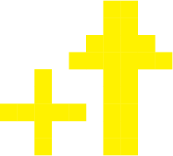

# Earth Defender
## Description
Earth Defender is an interactive alien-themed shooting game inspired by arcade games such as Space Invaders.

This project was done for ID 3510: Interactive Products in Fall 2019 at the Georgia Institute of Technology.

## Requirements
### Devices
1. Computer (macOS or Windows)

### Installations
1. Install [Processing](https://processing.org/download/) and required packages.
   - Install [Minim](http://code.compartmental.net/tools/minim/) for sound.
   
## Running the Game
1. Run the game through Processing
   - Open [EarthDefender.pde](EarthDefender/EarthDefender.pde).
   - Run by pressing Sketch > Run or the shortcut `Command + R` on Mac or `Ctrl + R` on Windows.
   - Run in full screen by pressing Sketch > Present or the shortcut `Shift + Command + R` on Mac or `Shift + Ctrl + R` on Windows.
   
## Playing the Game
### Rules:
- The game is a 1 player game.
- Press space bar to shoot lasers.
- Use left and right arrow keys to move left and right respectively.
- Use up arrow key to jump.
- Take down all aliens to move onto the next stage and beat all stages to win.
- Lose game if HP reaches 0 or the time runs out.
- Score is calculated by the HP left, time left, and number of hits.
- Items have various effects
  -  Health potion: restores a small amount of HP.
  -  Attack speed buff: increases the rate of laser fire.
  -  Extra time: increases the time left by a small amount.
